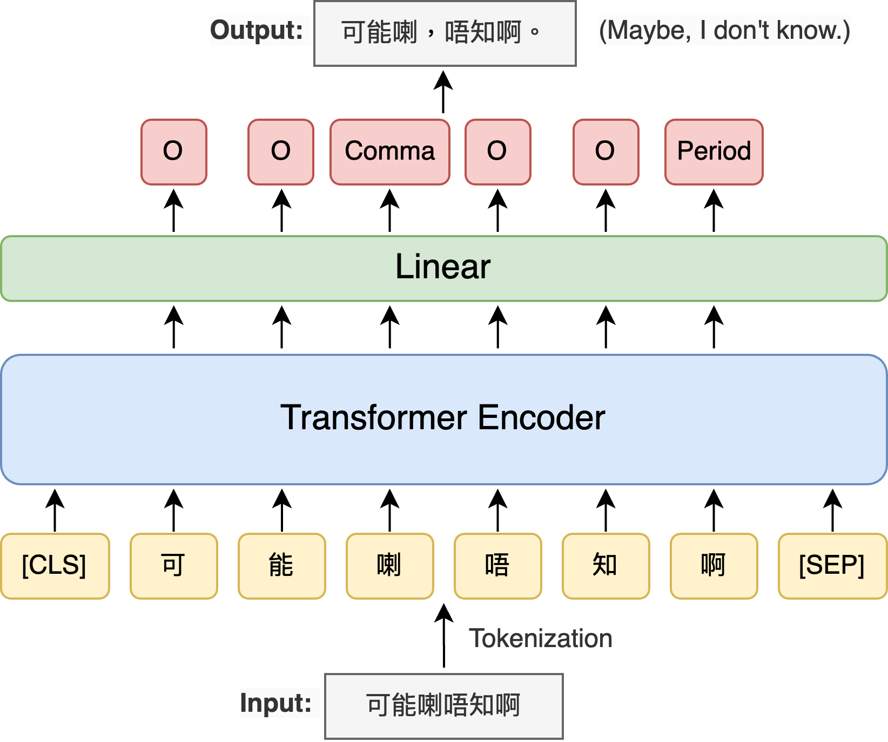

# Cantonese Punctuation Restoration using LLM Annotated Data

This repository contains the data and source code of the paper Cantonese Punctuation Restoration using LLM Annotated Data, accepted at  [Interspeech 2025](https://www.interspeech2025.org/).

## Abstract

One of the main challenges for punctuation restoration for a low-resource language such as Cantonese is data scarcity. While its spoken and written forms are very different, current Cantonese datasets are mostly from formal written text. Naturally spoken data are very scarce. To address this gap, we leverage LLM to annotate naturally spoken Cantonese transcripts sourced from YouTube. Then, we fine-tune pre-trained language models for punctuation restoration using the LLM-annotated transcripts. Our experiments show that models trained on LLM-annotated transcripts outperform those trained solely on formal written text, despite the smaller dataset size. Our best-performing model achieves performance on par with the strongest LLM evaluated on a benchmark dataset, while being significantly smaller. These findings highlight the potential of LLM-generated data for improving NLP tasks in low-resource languages.

## Data

### Youtube

We download videos in the following youtube playlists in MP3 format using [yt-dlp](https://github.com/yt-dlp/yt-dlp).

- Showbiz娛樂專訪: https://www.youtube.com/playlist?list=PL3GvCTq2j37-QDZ6fznA3IzCyCSiOsmYc
- 健康快訊: https://www.youtube.com/playlist?list=PL3GvCTq2j37-0j-2Rrfrszo-ze4qceY59
- 開市追揸沽 & ET開市直擊: https://www.youtube.com/playlist?list=PLw1D7LF5fHU2RzADjQHSguco_x7_xlVpC
- 央廣節目：自由廣場: https://www.youtube.com/playlist?list=PL4obi-HkLgFLCjWSpEqPVwRX6kE9KKgsU
- 桑普對談: https://www.youtube.com/playlist?list=PL4obi-HkLgFLogVGpzPi7wVj0OrsS_VCu
- Thailand 泰國: https://www.youtube.com/playlist?list=PLHX2wryodhB3-c7bXt9LNq4EcIr1NK1SL
- Indonesia 印尼: https://www.youtube.com/playlist?list=PLHX2wryodhB37iu76R1x3vNFl1ysFPDwj
- 行山好去處: https://www.youtube.com/playlist?list=PLp9AUTyGC_soitTBKlpBVyIhofNcEwinW

The following command is used to download the videos.

```
yt-dlp -P [PATH TO SAVE] -x --audio-format mp3 [LINK TO PLAYLIST]
```

A proprietary ASR model (not released) is used to transcribe the audios. The transcriptions are stored in `data/youtube`.

### HKCanCor

We download the Hong Kong Cantonese Corpus (HKCanCor) from the Python package [PyCantonese](https://pycantonese.org), pre-process it using `src/process_hkcancor.py` (e.g., remove utterances that have no punctuation or too short, replace ! with 。, etc), and save it in `data/hkcancor.csv`.

### Wikipedia

We pre-process the Cantonese Wikipedia in a similar fashion using the script `src/process_wikipedia.py`.

## LLM Benchmarking

To measure the performance of an LLM on the pre-processed HKCanCor dataset, run the following command.

```
python src/benchmark_llm.py --model Qwen/Qwen2.5-7B-Instruct
```

## Training

To run the experiment on evaluating various pre-trained transformer models, use the following command. Modify the arguments (e.g. `model_name_or_path`) as needed.

```
CUDA_VISIBLE_DEVICES=0 python src/train.py \
    --seed 21 \
    --per_device_train_batch_size 32 \
    --per_device_eval_batch_size 32 \
    --dataloader_num_workers 1 \
    --learning_rate 3e-5 \
    --lr_scheduler_type linear \
    --warmup_ratio 0.1 \
    --num_train_epochs 5 \
    --eval_strategy epoch \
    --save_strategy epoch \
    --save_total_limit 1 \
    --save_safetensors False \
    --save_only_model True \
    --metric_for_best_model micro_f \
    --load_best_model_at_end True \
    --do_train \
    --do_predict \
    --report_to none \
    --train_dataset data/wikipedia-zh-yue/train \
    --test_dataset data/hkcancor.csv \
    --model_name_or_path google-bert/bert-base-chinese \
    --output_dir outputs/bert-base-chinese_wikipedia \
```

The model is simply a transformer encoder with a token classification head.



